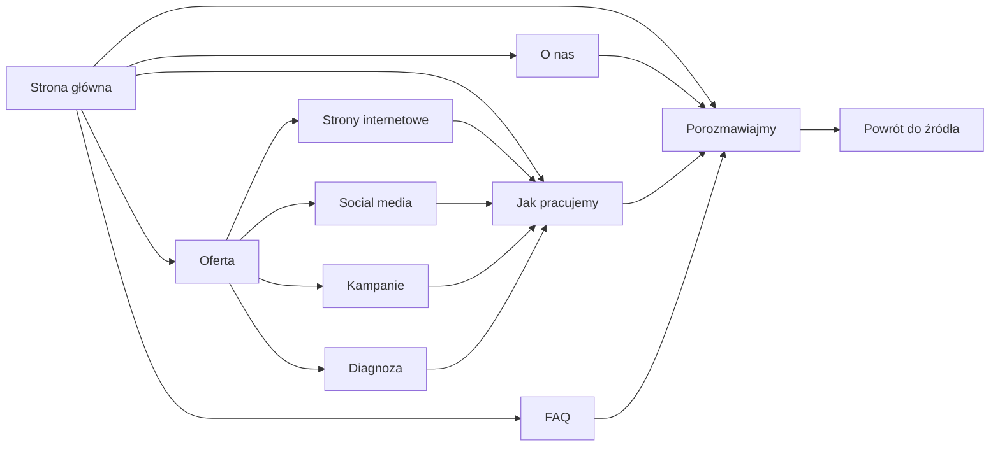

# OK Agency - mapa nawigacji

Ten dokument jest kontraktem nawigacyjnym aktywnej wersji serwisu w `05-website/hero_kimi`.

## Główna ścieżka użytkownika

## Stała nawigacja globalna

Każdy dokument publiczny ma dokładnie jeden page-level header oraz jeden landmark głównej nawigacji. Kolejność na desktopie i mobile jest stała:

| Etykieta | Cel | Rola |
| --- | --- | --- |
| Oferta | disclosure z linkiem `/menu` i usługami | wybór lub zmiana kierunku |
| O nas | `/o-nas` | osoba prowadząca i model pracy |
| Jak pracujemy | `/proces` | wspólny proces dla wszystkich usług |
| FAQ | `/faq` | odpowiedzi przed pierwszym kontaktem |
| Porozmawiajmy | `/kontakt` | rozpoczęcie rozmowy |

`Kontakt` nie występuje drugi raz jako zwykły link. Logo zawsze prowadzi do `/`.

Disclosure `Oferta` zawiera, w tej kolejności:

1. Zobacz całą ofertę - `/menu`
2. Strony internetowe - `/strony-internetowe`
3. Social media - `/social-media`
4. Kampanie - `/kampanie`
5. Diagnoza - `/diagnoza`

Disclosure działa kliknięciem, klawiaturą i dotykiem; Escape oraz kliknięcie poza nim zamykają panel. Na trasach oferty aktywny jest wspólny obszar `Oferta`.

## Zachowanie nagłówka

- Na początku dokumentu nagłówek jest stały, pełnej szerokości i wizualnie zadokowany.
- Statyczny slot rezerwuje jego wysokość, dlatego treść nie skacze po uruchomieniu JavaScript.
- Sentinel po około 24 px przełącza nagłówek w kompaktowy stan odłączony.
- Stan odłączony pozostaje widoczny niezależnie od kierunku przewijania.
- Powrót do początku dokumentu ponownie dokuje nagłówek.
- Na węższych ekranach jeden przycisk `Menu` otwiera jeden modalny dialog nawigacyjny.

## Kontekst między stronami

- Usługa -> Proces: `/proces?from=<kierunek>`.
- Usługa -> Kontakt: `/kontakt?context=<kierunek>`.
- Proces otwarty z usługi zachowuje kierunek także w linkach do kontaktu.
- Kontakt automatycznie wybiera temat i pokazuje powrót do strony źródłowej.
- Bez parametru kontekstu powrót prowadzi do pełnej oferty.

Dozwolone wartości kontekstu:

| Parametr | Strona źródłowa | Temat formularza |
| --- | --- | --- |
| `web` | Strony internetowe | Strona internetowa |
| `social` | Social media | Social media |
| `campaign` | Kampanie | Kampania płatna |
| `diagnosis` | Diagnoza | Diagnoza |
| `process` | Jak pracujemy | Proces współpracy |
| `about` | O nas | Inny temat |

## Zasady nazewnictwa

- Jedna etykieta globalna zawsze prowadzi do jednego celu.
- „Realizacje”, „Portfolio” i „Case studies” nie występują w nawigacji, ponieważ serwis nie publikuje materiałów klientów.
- Aktywny link otrzymuje `aria-current="page"`; aktywny disclosure ma widoczny stan wspólny dla tras oferty.
- Kotwice wewnątrz strony nie należą do nawigacji globalnej.

## Strony poza mapą produkcyjną

Katalogi `mockups`, `_src`, `05-editorial-atelier` i wcześniejsze handoffy nie są trasami produkcyjnymi. Nie linkujemy do nich z aktywnego serwisu.
