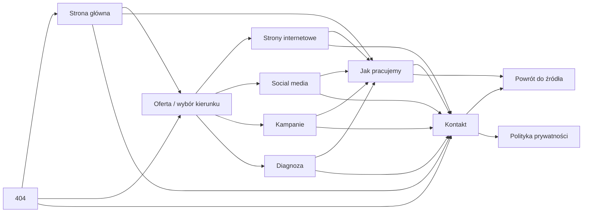

# OK Agency - mapa nawigacji

Ten dokument jest kontraktem nawigacyjnym aktywnej wersji serwisu. Obejmuje wyłącznie pliki w `05-website/hero_kimi`.

## Główna ścieżka użytkownika

## Stała nawigacja globalna

Na każdej stronie występują te same trzy pozycje, w tej samej kolejności:

| Etykieta | Cel | Rola |
| --- | --- | --- |
| Oferta | `/menu` | wybór lub zmiana kierunku |
| Jak pracujemy | `/proces` | wspólny proces dla wszystkich usług |
| Kontakt | `/kontakt` | rozpoczęcie rozmowy |

Logo zawsze prowadzi do `/`. Kotwice wewnątrz strony nie należą do nawigacji globalnej - prowadzą do nich przyciski i podpowiedzi przewijania w treści.

Polityka prywatności korzysta z tego samego nagłówka, a strona 404 pokazuje te same cele razem z przyciskami ratunkowymi do strony głównej, oferty i diagnozy.

## Kontekst między stronami

- Usługa -> Proces: `/proces?from=<kierunek>`.
- Usługa -> Kontakt: `/kontakt?context=<kierunek>`.
- Proces otwarty z usługi zachowuje kierunek także w linkach do kontaktu.
- Kontakt automatycznie wybiera temat i pokazuje powrót do strony, z której przyszedł użytkownik.
- Bez parametru kontekstu powrót prowadzi do pełnej oferty.

Dozwolone wartości kontekstu:

| Parametr | Strona źródłowa | Temat formularza |
| --- | --- | --- |
| `web` | Strony internetowe | Strona internetowa |
| `social` | Social media | Social media |
| `campaign` | Kampanie | Kampania płatna |
| `diagnosis` | Diagnoza | Diagnoza |
| `process` | Jak pracujemy | Coś innego |

## Zasady nazewnictwa

- Jedna etykieta globalna zawsze prowadzi do jednego celu.
- „Realizacje”, „Portfolio” i „Case studies” nie występują w nawigacji, ponieważ serwis nie publikuje materiałów klientów.
- Link aktywnego obszaru otrzymuje `aria-current="page"` i widoczny stan aktywny.
- Tekst linku opisuje cel, nie efekt animacji ani pozycję na ekranie.

## Strony poza mapą produkcyjną

Katalogi `mockups`, `_src`, `05-editorial-atelier` i wcześniejsze handoffy nie są trasami produkcyjnymi. Nie linkujemy do nich z aktywnego serwisu. Strona „O nas” pozostaje mockupem i nie pojawia się w menu do czasu wdrożenia trasy produkcyjnej.
