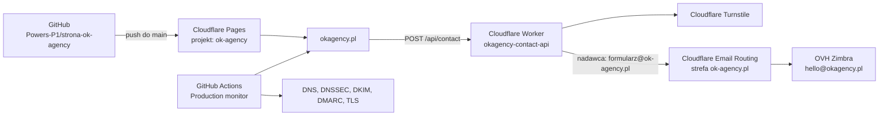

# Produkcja OK Agency — konfiguracja i utrzymanie

Stan dokumentacji: 2026-08-04.

Ten dokument opisuje produkcyjną konfigurację serwisu, podział
odpowiedzialności między GitHub, Cloudflare i OVH oraz bezpieczne procedury
zmian. Całość została zaprojektowana tak, aby działała w ramach Cloudflare
Free. Nie zapisujemy tutaj tokenów, haseł ani wartości sekretów.

## 1. Architektura



Serwis jest statyczny. Cloudflare Pages publikuje zawartość katalogu `dist/`,
a osobny Worker obsługuje wyłącznie endpoint formularza kontaktowego.

## 2. Systemy i miejsca konfiguracji

| Obszar | System | Gdzie szukać |
| --- | --- | --- |
| Kod i automatyzacja | GitHub | repozytorium `Powers-P1/strona-ok-agency` |
| Hosting strony | Cloudflare Pages | Workers & Pages → `ok-agency` |
| API formularza | Cloudflare Workers | Workers & Pages → `okagency-contact-api` |
| DNS obu domen | Cloudflare | Websites → domena → DNS → Records |
| DNSSEC, SSL i HSTS | Cloudflare | domena → DNS → Settings oraz SSL/TLS → Edge Certificates |
| Przekierowania domen | Cloudflare | domena → Rules → Redirect Rules |
| Turnstile | Cloudflare | Turnstile → widget `okagency-contact` |
| Web Analytics | Cloudflare | Analytics & Logs → Web Analytics |
| Analityka serwisu | Google Analytics 4 | Analytics → właściwość i strumień `okagency.pl` |
| Konwersje reklamowe | Google Ads | Cele → Konwersje oraz połączony Google tag |
| Konwersje Meta | Meta Events Manager | Dataset / Pixel przypisany do `okagency.pl` |
| Rejestracja domen i rekordy DS | OVHcloud | Web Cloud → Domain names → domena |
| Skrzynka `hello@okagency.pl` | OVHcloud | Web Cloud → Email / Zimbra |
| Sekrety wdrożeniowe | GitHub | Settings → Secrets and variables → Actions |
| Sekret Turnstile | Cloudflare Worker | `okagency-contact-api` → Settings → Variables and Secrets |

## 3. Domeny i ruch WWW

### `okagency.pl`

- domena kanoniczna strony;
- rejestrator: OVHcloud;
- autorytatywny DNS: Cloudflare (`ara.ns.cloudflare.com` i
  `pranab.ns.cloudflare.com`);
- zawartość: projekt Cloudflare Pages `ok-agency`;
- poczta przychodząca: OVH Zimbra;
- `https://www.okagency.pl/*` jest przekierowywane kodem `301` na
  `https://okagency.pl/*` przez Cloudflare Redirect Rules;
- `www` nie wymaga osobnego podpięcia jako custom domain do Pages.

### `ok-agency.pl`

- domena alternatywna;
- rejestrator: OVHcloud;
- autorytatywny DNS: Cloudflare;
- `https://ok-agency.pl/*` i `https://www.ok-agency.pl/*` są przekierowywane
  kodem `301` na domenę kanoniczną;
- strefa jest dodatkowo używana przez darmowy Cloudflare Email Routing jako
  zweryfikowana domena nadawcy formularza.

### Domena Pages

Dokładny host produkcyjny `ok-agency.pages.dev` przekierowuje na
`okagency.pl`, zachowując ścieżkę i query string. Odpowiada za to
[`functions/_middleware.js`](../functions/_middleware.js).

Haszowane adresy i aliasy wdrożeń preview pozostają dostępne dla pull
requestów. Nie są domeną kanoniczną.

## 4. Cloudflare Pages

Konfiguracja projektu `ok-agency`:

| Ustawienie | Wartość |
| --- | --- |
| Provider | GitHub |
| Repozytorium | `Powers-P1/strona-ok-agency` |
| Gałąź produkcyjna | `main` |
| Build command | `npm run build` |
| Build output directory | `dist` |
| Node.js | 24 w CI i Pages, minimum 22 lokalnie |

Build wykonuje [`scripts/build.mjs`](../scripts/build.mjs):

1. kopiuje produkcyjne HTML-e i `assets/`;
2. kopiuje `robots.txt`, `sitemap.xml` i `.well-known/`;
3. generuje finalny plik `_headers`;
4. oblicza hashe CSP dla dozwolonych atrybutów `style`;
5. odrzuca build, jeśli ktoś ponownie doda `<style>`, wykonywalny skrypt
   inline albo `unsafe-inline`.

Szablon nagłówków znajduje się w [`_headers`](../_headers), a generator CSP w
[`scripts/csp.mjs`](../scripts/csp.mjs).

## 5. Formularz kontaktowy

### Przepływ

1. `kontakt.html` renderuje widget Turnstile.
2. Przeglądarka wysyła JSON do `POST https://okagency.pl/api/contact`.
3. Worker sprawdza metodę, `Origin`, typ i rozmiar body oraz pola formularza.
4. Worker weryfikuje token Turnstile po stronie serwera.
5. Wiadomość jest wysyłana jako `formularz@ok-agency.pl` do
   `hello@okagency.pl`; adres użytkownika trafia do `Reply-To`.
6. Po udanej wysyłce i wyłącznie przy zgodzie marketingowej Worker zleca
   nieblokującą wysyłkę deduplikowanego zdarzenia `Contact` do Meta CAPI.

Kod endpointu: [`worker/contact.js`](../worker/contact.js).

Istotne zabezpieczenia:

- dozwolone origins: `https://okagency.pl` i `https://www.okagency.pl`;
- tylko `POST /api/contact`;
- maksymalny request: 64 KiB;
- maksymalna wiadomość: 5000 znaków;
- honeypot `fax`;
- Turnstile action: `contact`;
- kontrola hostname Turnstile;
- token Turnstile jest jednorazowy;
- odpowiedzi API i logi nie zawierają treści formularza.

### Worker

Nazwa: `okagency-contact-api`.

Konfiguracja: [`wrangler.contact.jsonc`](../wrangler.contact.jsonc).

Trasy:

- `okagency.pl/api/contact*`;
- `www.okagency.pl/api/contact*`.

Jawne zmienne konfiguracyjne:

| Zmienna | Wartość |
| --- | --- |
| `CONTACT_FROM` | `formularz@ok-agency.pl` |
| `CONTACT_TO` | `hello@okagency.pl` |
| `TURNSTILE_HOSTNAMES` | `okagency.pl,www.okagency.pl` |
| `META_PIXEL_ID` | `1057817209974571` |
| `META_GRAPH_VERSION` | `v25.0` |

Binding `SEND_EMAIL` jest ograniczony do:

- nadawcy `formularz@ok-agency.pl`;
- odbiorcy `hello@okagency.pl`.

Worker nie ma publicznej domeny `workers.dev`. Observability i invocation logs
są włączone z próbkowaniem 100%. Poprawna wysyłka zapisuje zdarzenie
`contact_email_sent`, a błąd `contact_email_send_failed` bez danych klienta.
Integracja CAPI loguje wyłącznie `meta_capi_sent`, `meta_capi_send_failed` z
kodem HTTP albo `meta_capi_configuration_missing`; logi nie zawierają tokenu,
e-maila, telefonu, skrótów ani treści formularza.

### Turnstile

Widget: `okagency-contact`, tryb Managed, bez pre-clearance.

Dozwolone hosty:

- `okagency.pl`;
- `www.okagency.pl`;
- `ok-agency.pl`;
- `www.ok-agency.pl`;
- `localhost`;
- `127.0.0.1`.

Publiczny site key znajduje się w
[`kontakt.html`](../kontakt.html). Tajny klucz istnieje wyłącznie jako
zaszyfrowany sekret Workera `TURNSTILE_SECRET` i nie może trafić do GitHuba,
pliku `.env`, dokumentacji ani logów.

Aktualizacja sekretu z CLI:

```powershell
npx wrangler secret put TURNSTILE_SECRET --config wrangler.contact.jsonc
```

Token bezpośredniej integracji Meta istnieje wyłącznie jako GitHub Actions
Secret `META_CAPI_TOKEN`. Workflow `Contact Worker deploy` przekazuje go przez
stdin do `wrangler secret put META_CAPI_TOKEN --config wrangler.contact.jsonc`
i tworzy lub aktualizuje zaszyfrowany sekret właściwego Workera przed
wdrożeniem. Token nie może trafić do `wrangler.contact.jsonc`, logów, PR ani
dokumentacji. Po rotacji trzeba zastąpić wartość w GitHub Secret i uruchomić
workflow ręcznie; nie wymaga to zmiany kodu.

## 6. Poczta i ochrona domen

### Skrzynka firmowa `hello@okagency.pl`

Skrzynka znajduje się w OVH Zimbra. Publiczna konfiguracja domeny:

| Typ | Nazwa | Wartość / cel |
| --- | --- | --- |
| MX 1 | `okagency.pl` | `mx1.mail.ovh.net` |
| MX 5 | `okagency.pl` | `mx2.mail.ovh.net` |
| MX 100 | `okagency.pl` | `mx3.mail.ovh.net` |
| SPF | `okagency.pl` | `v=spf1 include:mx.ovh.com -all` |
| DKIM | `ovhmo-selector-1._domainkey` | CNAME do selektora OVH |
| DKIM | `ovhmo-selector-2._domainkey` | CNAME do selektora OVH |
| DMARC | `_dmarc.okagency.pl` | `p=quarantine`, `sp=quarantine`, `adkim=s`, `aspf=s`, `pct=100` |

Raporty DMARC trafiają do raportowania Cloudflare oraz na
`hello@okagency.pl`.

### Domena nadawcy `ok-agency.pl`

Cloudflare Email Routing zostało włączone dla domeny alternatywnej, aby Worker
mógł wysyłać z `formularz@ok-agency.pl` bez płatnego Cloudflare Email
Sending.

Cloudflare zarządza trzema rekordami MX `route*.mx.cloudflare.net` oraz
rekordem DKIM `cf2024-1._domainkey`. Dodatkowo:

| Typ | Nazwa | Wartość |
| --- | --- | --- |
| SPF | `ok-agency.pl` | `v=spf1 include:_spf.mx.cloudflare.net ~all` |
| DMARC | `_dmarc.ok-agency.pl` | `p=quarantine`, `sp=quarantine`, `adkim=s`, `aspf=s`, `pct=100` |

Nie należy zastępować rekordów MX/DKIM tworzonych automatycznie przez Email
Routing ręcznymi odpowiednikami.

### Ważna decyzja kosztowa

Płatne Cloudflare Email Sending pozostaje wyłączone. Formularz używa
rozwiązania zgodnego z Cloudflare Free: Worker Send Email binding +
zweryfikowany sender w Email Routing.

## 7. DNS, DNSSEC i TLS

- Cloudflare jest autorytatywnym DNS dla obu domen.
- DNS Anycast jest właściwością usługi Cloudflare DNS i nie wymaga osobnej
  konfiguracji ani dopłaty.
- DNSSEC działa dla `okagency.pl` i `ok-agency.pl`.
- Rekordy DS są utrzymywane u rejestratora OVHcloud.
- Zmieniając DNSSEC, należy zawsze skopiować bieżący DS z Cloudflare do OVH;
  nie należy przepisywać wartości z dokumentacji historycznej.
- Stary `ftp.okagency.pl` został usunięty.
- Stare rekordy TXT mechanizmu przekierowań OVH zostały usunięte.

TLS:

- certyfikaty: Cloudflare Universal SSL;
- certyfikat Universal i certyfikat zapasowy mają status aktywny/wystawiony
  dla obu stref;
- Certificate Transparency Monitoring jest włączony dla obu domen;
- tryb HTTPS i przekierowania są realizowane na brzegu Cloudflare;
- HSTS dla obu domen: `max-age=15552000` (6 miesięcy);
- `includeSubDomains` i preload są celowo wyłączone, aby nie obejmować
  przyszłych subdomen i nie wprowadzać trudnego do odwrócenia preloadu;
- ręczny CAA nie został dodany — Cloudflare zarządza wymaganiami CA dla
  Universal SSL, a zbyt wąski CAA mógłby zablokować odnowienie certyfikatu.

## 8. Nagłówki bezpieczeństwa i SEO

Finalne nagłówki po buildzie obejmują:

- CSP bez `unsafe-inline`;
- losowy, 128-bitowy nonce dodawany do `script-src` osobno dla każdej
  odpowiedzi HTML przez [`functions/_middleware.js`](../functions/_middleware.js);
- `frame-ancestors 'none'` i `X-Frame-Options: DENY`;
- `X-Content-Type-Options: nosniff`;
- `Referrer-Policy: origin`, aby także nawigacja wewnętrzna nie przekazywała
  ścieżki ani parametrów adresu do narzędzi zewnętrznych;
- ograniczone Permissions Policy;
- COOP i Cross-Origin-Resource-Policy;
- `upgrade-insecure-requests`.

Fonty Archivo i Barlow Condensed są publikowane lokalnie z
`/assets/fonts/`, dlatego przeglądarka nie łączy się z Google Fonts. Zewnętrzne
źródła w CSP są ograniczone do rzeczywiście używanych endpointów Cloudflare,
Google tag / Google Analytics / Google Ads i Meta Pixel. Przy zmianie dostawcy
lub sposobu wysyłania zdarzeń należy najpierw zaktualizować `_headers`, testy CSP
i Politykę prywatności; nie wolno rozszerzać dyrektyw domeną „na zapas”.

Cloudflare Bot Fight Mode na planie Free automatycznie uruchamia JavaScript
Detections i dokleja skrypt do odpowiedzi HTML. Middleware dodaje nonce do
nagłówka CSP, a Cloudflare przenosi tę samą wartość na wstrzyknięty skrypt.
Dzięki temu JavaScript Detections działa bez `unsafe-inline`, stałego nonce ani
wyłączania Bot Fight Mode. Nonce nie jest zapisywany w statycznych plikach i nie
wolno zastępować go wartością stałą.

SEO:

- domena kanoniczna: `https://okagency.pl`;
- canonicale znajdują się w HTML;
- sitemap używa adresów bez `.html`;
- repozytoryjny [`robots.txt`](../robots.txt) jest jedynym źródłem polityki
  crawlerów i wskazuje sitemapę;
- funkcja Cloudflare **Managed robots.txt** w AI Crawl Control → Signals jest
  wyłączona, dlatego Cloudflare nie dokleja własnych dyrektyw ani
  `Content-Signal` przed plikiem z repo;
- `OAI-SearchBot`, `ChatGPT-User`, `Googlebot`, `PerplexityBot`,
  `Perplexity-User`, `Claude-SearchBot` i `Claude-User` mogą indeksować lub
  pobierać publiczne treści do odpowiedzi z cytowaniem;
- `GPTBot`, `ClaudeBot` i `Google-Extended` mają `Disallow: /`, ponieważ trening
  modeli nie jest wymagany do prezentowania strony w wynikach lub odpowiedziach
  AI;
- `llms.txt` i `llms-full.txt` są kopiowane do artefaktu produkcyjnego jako
  dodatkowy, niewiążący opis serwisu dla systemów, które obsługują ten format;
- plik `2382e47d9da34145abc8ae8f95f6c510.txt` potwierdza własność domeny dla
  protokołu IndexNow; po publikacji zmian uruchom `npm run submit:indexnow`, aby
  zgłosić wszystkie adresy z `sitemap.xml` do współpracujących wyszukiwarek;
- `ok-agency.pages.dev` nie publikuje duplikatu treści;
- `security.txt` znajduje się w
  [`.well-known/security.txt`](../.well-known/security.txt).

Zmiana polityki crawlerów wymaga edycji `robots.txt`, przejścia CI i wdrożenia
Cloudflare Pages. Nie należy ponownie włączać Cloudflare Managed `robots.txt`,
ponieważ utworzyłoby to drugą, potencjalnie sprzeczną politykę.

Przy zmianie kontaktu należy zaktualizować `security.txt`. Przed datą
`Expires` trzeba odnowić jego termin.

## 9. Analityka, reklamy i zgody

### Cloudflare Web Analytics

Cloudflare Web Analytics jest skonfigurowane w trybie automatycznym dla
`okagency.pl`. Beacon jest wstrzykiwany przez Cloudflare i nie jest ręcznie
wklejony do HTML.

CSP zezwala na:

- skrypt `https://static.cloudflareinsights.com`;
- połączenia do `https://cloudflareinsights.com` oraz własnej domeny.

To rozwiązanie działa w Cloudflare Free.

### Google Analytics 4, Google Ads i Meta Pixel

Właścicielem implementacji przeglądarkowej jest
[`assets/analytics.js`](../assets/analytics.js). Plik obsługuje Google tag dla
Google Analytics 4 i Google Ads, Meta Pixel, stan zgody oraz atrybucję źródła
wizyty. Identyfikatory publicznych tagów znajdują się wyłącznie w tym pliku;
nie należy tworzyć drugiej implementacji w HTML ani wstrzykiwać dodatkowego
kontenera przez panel hostingu.

Kontrakt prywatności:

- obowiązuje Basic Consent Mode: przed wyborem oraz po „Odrzuć” skrypty Google
  i Meta nie są ładowane i nie może powstać żaden request do ich endpointów;
- „Tylko analityka” ustawia wyłącznie `analytics_storage: granted`; uruchamia
  wyłącznie GA4, ale pozostawia wszystkie trzy stany reklamowe jako `denied` i
  nie inicjalizuje Google Ads, Meta Pixel ani atrybucji marketingowej;
- „Analityka i reklamy” ustawia wszystkie cztery stany na `granted` i dopiero
  wtedy uruchamia Meta Pixel, konwersje Google Ads oraz atrybucję marketingową;
- odmowa nie blokuje strony, „Diagnozy” ani formularzy;
- decyzja jest zapisywana lokalnie wraz z wersją polityki maksymalnie przez
  180 dni, a „Ustawienia cookies” w stopce ponownie otwierają panel i pozwalają
  zmienić jej zakres;
- obniżenie lub wycofanie zgody zatrzymuje requesty objęte wycofanym zakresem;
  przy pełnym wycofaniu widok jest w razie potrzeby odświeżany, aby usunąć
  wcześniej załadowane tagi Google i Meta;
- zdarzenia analityczne nie mogą zawierać imienia, e-maila, telefonu, nazwy
  firmy, treści wiadomości ani konkretnych odpowiedzi „Diagnozy”;
- zdarzenie `diagnosis_complete` może zawierać wyłącznie parametr
  `diagnosis_outcome` z allowlisty `website`, `social`, `campaign`,
  `conversation`, `none`; trafia do GA4 po zgodzie analitycznej i do Meta po
  zgodzie marketingowej, nigdy nie zawiera konkretnych odpowiedzi;
- losowy `analyticsEventId` jest tworzony wyłącznie po zgodzie marketingowej,
  nie zawiera PII i jest dołączany do requestu formularza oraz wiadomości e-mail;
  po odpowiedzi API z `ok: true` ten sam identyfikator trafia jako Meta
  `eventID` i Google Ads `transaction_id`, aby technicznie powiązać konwersję i
  ograniczyć jej podwójne zliczenie;
- zdarzenie leada jest wywoływane dopiero po odpowiedzi API z `ok: true`;
- ukończenie „Diagnozy” nie przesyła odpowiedzi. Odpowiedzi trafiają do
  Administratora dopiero po świadomym wysłaniu opcjonalnego formularza.

Atrybucja może zostać uruchomiona wyłącznie po wyborze „Analityka i reklamy”.
Przechowuje na czas sesji parametry kampanii i kliknięcia (`utm_*`, `gclid`,
`gbraid`, `wbraid`, `fbclid`), stronę wejścia i referrer. Dostępne dane mogą
zostać dołączone do wysyłanego zgłoszenia. Po „Odrzuć” i „Tylko analityka”
formularz działa bez atrybucji marketingowej. Nie należy zapisywać w tym
mechanizmie pól formularza ani innych danych podanych przez użytkownika.

Identyfikator zdarzenia nie jest atrybucją ani identyfikatorem osoby. Nie może
powstać przy poziomie `denied` lub `analytics`. Po skutecznym przyjęciu
formularza i wyłącznie przy zgodzie marketingowej Worker wysyła Meta CAPI
standardowe zdarzenie `Contact` z tym samym `event_id`, którego Pixel używa jako
`eventID`. Deduplikacja opiera się na parze nazwa zdarzenia + identyfikator.
E-mail i opcjonalny telefon są normalizowane i haszowane SHA-256 w Workerze;
do zdarzenia mogą również wejść IP, user-agent, `_fbp`, `_fbc` i bezpieczny URL
źródłowy bez query/hash. Treść wiadomości, nazwa firmy, imię i odpowiedzi
„Diagnozy” nie są wysyłane do CAPI. Błąd CAPI nie blokuje doręczenia zgłoszenia.

Google Enhanced Conversions działa tylko dla skutecznie przyjętego formularza
i tylko przy zgodzie marketingowej. Bezpośrednio przed zdarzeniem konwersji
Google tag otrzymuje znormalizowany e-mail i opcjonalny telefon przez
`user_data`; dane te nie trafiają do parametrów zdarzeń GA4.

Po każdej zmianie analityki należy sprawdzić co najmniej pięć scenariuszy:

1. pierwsza wizyta bez decyzji — wszystkie cztery stany `denied`, brak cookies,
   skryptów, cookies, requestów Google i Meta oraz zapisanej atrybucji;
2. „Odrzuć” — ten sam stan `denied`, zero requestów Google i Meta oraz poprawne
   działanie strony, „Diagnozy” i formularza;
3. „Tylko analityka” — `analytics_storage: granted`, trzy stany reklamowe
   `denied`, pojedyncze zdarzenia w GA4 DebugView, brak requestów Google Ads i
   Meta Pixel, brak atrybucji marketingowej i brak `analyticsEventId`;
4. „Analityka i reklamy” — wszystkie cztery stany `granted`, pojedyncze
   zdarzenia w GA4 DebugView, Google Ads i Meta Test Events oraz atrybucja bez
   niezamierzonego PII; dla leada ten sam losowy identyfikator występuje w
   żądaniu formularza, e-mailu, Meta Pixel `eventID`, Meta CAPI `event_id` i
   Google Ads `transaction_id`; dane kontaktowe występują wyłącznie w
   kontrolowanych polach Enhanced Conversions i jako SHA-256 w CAPI;
5. obniżenie zakresu lub „Odrzuć” po wcześniejszej zgodzie — właściwe stany
   `denied`, wyczyszczona atrybucja po utracie zgody marketingowej i zero
   requestów do narzędzi objętych wycofanym zakresem po zastosowaniu decyzji.

Retencja danych na poziomie użytkownika i zdarzenia w GA4 jest ustawiona na
14 miesięcy. Decyzja o zgodzie wygasa po 180 dniach. Ustawienia retencji i
udostępniania danych w Google Ads oraz Meta wymagają okresowego przeglądu.
Enhanced Conversions i bezpośrednie Meta Conversions API są aktywne zgodnie z
powyższym kontraktem. Wersja polityki zgody `3` wymusza ponowny wybór po zmianie
zakresu. Meta Automatic Advanced Matching pozostaje wyłączone, ponieważ jawna,
serwerowa integracja przekazuje wyłącznie kontrolowany zestaw danych po udanym
formularzu i nie skanuje automatycznie DOM.

## 10. GitHub i wdrożenia

### Ochrona `main`

Włączone są:

- wymagane checki `validate` i `Cloudflare Pages`;
- aktualność gałęzi względem `main`;
- egzekwowanie zasad dla administratorów;
- linear history;
- wymagane rozwiązanie komentarzy review;
- blokada force-push i usuwania gałęzi.

Secret scanning, push protection, Dependabot alerts i Dependabot security
updates są włączone.

### Workflowy

| Workflow | Plik | Uruchomienie |
| --- | --- | --- |
| CI | [`.github/workflows/ci.yml`](../.github/workflows/ci.yml) | PR oraz push do `main` |
| Worker deploy | [`.github/workflows/contact-worker-deploy.yml`](../.github/workflows/contact-worker-deploy.yml) | zmiana Workera/configu na `main` lub ręcznie |
| Production monitor | [`.github/workflows/production-monitor.yml`](../.github/workflows/production-monitor.yml) | co 6 godzin i ręcznie |

Akcje GitHub są przypięte do pełnych SHA.

### Sekrety GitHub Actions

Repozytorium ma dwa sekrety potrzebne wyłącznie do wdrażania Workera:

- `CLOUDFLARE_WORKERS_DEPLOY_TOKEN`;
- `CLOUDFLARE_ACCOUNT_ID`.

Token Cloudflare powinien mieć tylko:

- Account → Workers Scripts → Edit dla właściwego konta;
- Zone → Workers Routes → Edit wyłącznie dla `okagency.pl`.

Nie należy dodawać mu uprawnień DNS, Pages, Turnstile, billing ani profile.

## 11. Monitoring i alerty

Workflow `Production monitor` działa o minucie 17 co 6 godzin. Sprawdza:

- dostępność strony głównej, kontaktu, `security.txt` i API;
- brak nakładki Cloudflare w `robots.txt` oraz obecność kluczowych reguł
  crawlerów z repo;
- przekierowania `www`, domeny alternatywnej i `pages.dev`;
- HSTS obu domen;
- DNSSEC obu domen;
- DMARC i DKIM obu domen wysyłających;
- brak starego `ftp.okagency.pl`;
- zaufany łańcuch TLS, zgodność nazwy hosta i ważność certyfikatu przez co
  najmniej 21 dni dla `okagency.pl`, `www.okagency.pl`, `ok-agency.pl` oraz
  `www.ok-agency.pl`.

Awaria otwiera lub aktualizuje issue z etykietą `production-monitor`.
Powrót do poprawnego działania dodaje komentarz i zamyka issue.

Ręczne uruchomienie:

```powershell
gh workflow run production-monitor.yml `
  --repo Powers-P1/strona-ok-agency `
  --ref main
```

## 12. Procedury operacyjne

### Zmiana strony

```powershell
npm ci
npm run sync:asset-versions
npm run check:asset-versions
npm run check:links
npx playwright install --with-deps chromium
npm run check:scene-disclosures
npm run check:annotation-geometry
npm run check:system-scale
npm run build
npm run check:pages-functions
npm run check:worker
```

Wersje wspólnych CSS/JS są utrzymywane wyłącznie w
[`scripts/asset-versions.mjs`](../scripts/asset-versions.mjs). Komenda
`sync:asset-versions` aktualizuje wszystkie produkcyjne HTML-e, a
`check:asset-versions` blokuje ręcznie rozjechane query stringi.

Workflow `CI / validate` instaluje Chromium wraz z zależnościami systemowymi i
uruchamia trzy bramki kontraktu UI przed zbudowaniem artefaktu:

- `check:scene-disclosures` sprawdza pełnokadrową geometrię scen, brak
  wewnętrznych scrollerów, widoczność rozwiniętych treści i położenie akcji;
- `check:annotation-geometry` otwiera punkty na sześciu trasach i kontroluje
  dymki, łączniki, bezpieczne strefy treści oraz widoczność po scrollowaniu;
- `check:system-scale` sprawdza 13 publicznych tras do 4K, wybrane proporcje
  i resize do 8K, wspólne role typograficzne, pełny kadr scen, brak overflow
  oraz wszystkie pytania Diagnozy wraz z awaryjnym wariantem bez grafiki.

Podczas iteracji uruchamiaj różnicowo test odpowiadający zmienianemu
kontraktowi. `check:system-scale` uruchom raz po ustabilizowaniu zmian i przed
PR; CI wykonuje tę bramkę ponownie dla każdego PR i pushu do `main`.
`check:system-scale:full` służy do ręcznego audytu pełnej macierzy, pionowych
proporcji i zrzutów ekranu, a `check:system-scale:webkit` do kontroli silnika
WebKit. Tych dwóch rozszerzonych wariantów nie uruchamiaj po każdej małej
poprawce.

Jeżeli instalacja przeglądarki lub którykolwiek test kontraktu zawiedzie, nie
omijaj bramki: odtwórz właściwy test lokalnie i popraw wspólny kontrakt albo
sam test razem z dokumentacją.

Następnie:

1. utwórz gałąź;
2. wypchnij zmiany;
3. utwórz pull request;
4. poczekaj na `validate` i `Cloudflare Pages`;
5. rozwiąż komentarze review;
6. scal PR do `main`;
7. sprawdź produkcję i uruchom ręcznie monitor.

### Zmiana Workera

Zmiany w `worker/**`, `wrangler.contact.jsonc`, zależnościach lub workflow
wdrożeniowym automatycznie uruchamiają `Contact Worker deploy` po merge do
`main`.

Po wdrożeniu sprawdź:

```powershell
curl.exe -I https://okagency.pl/api/contact
```

Poprawny request `GET` powinien zwrócić `405` i nagłówek `Allow: POST`.
Pełny test wysyłki wymaga świeżego tokenu Turnstile z formularza.

### Rotacja tokenu wdrożeniowego

1. Utwórz nowy token w Cloudflare z opisanymi wyżej minimalnymi
   uprawnieniami.
2. Zastąp `CLOUDFLARE_WORKERS_DEPLOY_TOKEN` w GitHub Actions Secrets.
3. Uruchom ręcznie `Contact Worker deploy`.
4. Po poprawnym wdrożeniu unieważnij poprzedni token.

Nigdy nie wklejaj tokenu do issue, PR, terminalowego polecenia zapisywanego w
historii ani pliku repozytorium.

### Zmiana Turnstile

1. Zachowaj nazwę widgetu i listę hostów.
2. Zaktualizuj publiczny site key w `kontakt.html`.
3. Zapisz nowy secret jako `TURNSTILE_SECRET` Workera.
4. Wdróż stronę i Worker.
5. Wykonaj pełny test formularza i sprawdź zdarzenie
   `contact_email_sent`.

### Zmiana DNS lub DNSSEC

1. Zrób zrzut bieżących rekordów.
2. Zmień tylko właściwą strefę w Cloudflare.
3. Przy DNSSEC zsynchronizuj DS w OVH.
4. Poczekaj na propagację.
5. Sprawdź rekord z publicznego resolvera i uruchom monitor produkcji.

Przykłady:

```powershell
Resolve-DnsName okagency.pl -Type NS -Server 1.1.1.1
Resolve-DnsName okagency.pl -Type MX -Server 1.1.1.1
Resolve-DnsName _dmarc.okagency.pl -Type TXT -Server 1.1.1.1
curl.exe -I https://okagency.pl/
curl.exe -I https://ok-agency.pl/
```

## 13. Granice darmowego wariantu

Celowo wyłączone lub niewykorzystywane:

- płatne Cloudflare Email Sending;
- ręczny CAA ograniczający wystawców Universal SSL;
- HSTS preload;
- osobny Pages custom domain dla `www`;
- publiczna domena `workers.dev` dla formularza.

Nie należy włączać płatnej funkcji Cloudflare bez osobnej decyzji. 2FA i
metody płatności nie są częścią konfiguracji tego repozytorium.

## 14. Rozszerzona diagnostyka WWW

Produkcja rozszerzonej diagnostyki składa się z Workera `okagency-site-audit-api`, D1 `okagency-site-audits`, Queue i DLQ o tych samych nazwach oraz VPS OVHcloud `vps-eea6bbe0.vps.ovh.net` w Warszawie. VPS ma Ubuntu 24.04, 2 vCPU, 4 GB RAM, 40 GB dysku i automatyczny backup OVH.

Kod wdrożenia znajduje się w [`deploy/n8n`](../deploy/n8n), a na serwerze w `/opt/okagency-audit`. Compose uruchamia PostgreSQL 16, n8n 1.123.65, izolowany audit runner i Caddy; obrazy bazowe są przypięte po digest. n8n słucha wyłącznie na `127.0.0.1:5678`, runner nie ma publicznego portu, a Caddy publikuje tylko `/healthz` i dokładny webhook intake. Pozostałe ścieżki zwracają `404`.

SSH dopuszcza wyłącznie klucz użytkownika `ubuntu`; logowanie hasłem i root są wyłączone. Aktywne są UFW, fail2ban, unattended-upgrades i 1 GB swapu. Dedykowany klucz operatorski znajduje się poza repozytorium w `C:\Users\dkaro\.ssh\okagency_n8n_vps_ed25519`; jego odcisk to `SHA256:EZ2VIjmDV3cq0KHxlZGGwpfTBry0pTbq4wMx32gwB0E`. Zweryfikowany odcisk klucza hosta ED25519 VPS to `SHA256:kAN8gPdbYsJ17ttl00vhjiWlEElFWvY/1wEwBqmXvRY`.

Worker wysyła webhook przez Caddy z dodatkową parą losowych nagłówków bramki i podpisem HMAC. Caddy redaguje identyfikator bramki, jej sekret oraz podpis z access logów. Callback omija Bot Fight Mode strefy przez callback-only host `okagency-site-audit-api.oli-struska.workers.dev`; kod udostępnia tam wyłącznie podpisany endpoint callbacku, a każdy inny request otrzymuje `404`.

Kontrakt raportu `2.0` (`RULESET_VERSION=2026.08.2`, `SCANNER_VERSION=2.0.3`) obejmuje siedem kategorii. Runner zbiera publiczne A/AAAA, NS, CAA, MX, SPF, DMARC i sygnał DNSSEC, parametry TLS i nagłówki HTTP, robots.txt, maksymalnie 3 mapy XML oraz próbkę do 8 podstron tego samego hosta przy współbieżności 2. Każde połączenie i przekierowanie przechodzi kontrolę SSRF oraz limit czasu i rozmiaru. Raport zapisuje sanitarną diagnostykę kolektorów; nie zawiera domeny w logach kolektora ani sekretów. Raport PDF jest generowany dopiero po kliknięciu, lokalnie w przeglądarce, z tych samych fontów i ról kolorystycznych co serwis; nie istnieje osobny endpoint PDF ani wysyłka e-mail.

Codzienny backup PostgreSQL wykonuje `okagency-audit-backup.timer` około 03:20 czasu Warszawy. Pliki custom-format mają uprawnienia tylko dla roota, trafiają do `/var/backups/okagency-audit` i są utrzymywane przez 7 dni. Timer należy kontrolować poleceniami:

```bash
sudo systemctl status okagency-audit-backup.timer
sudo systemctl status okagency-audit-backup.service
sudo ls -lh /var/backups/okagency-audit
```

Odtworzenie wykonuje się do zatrzymanej lub pustej bazy po wcześniejszym skopiowaniu bieżącego dumpa poza serwer. Przykładowa kontrola i restore:

```bash
sudo docker exec -i okagency-site-audit-postgres-1 pg_restore --list < backup.dump
sudo docker exec -i okagency-site-audit-postgres-1 pg_restore -U n8n -d n8n --clean --if-exists < backup.dump
```

Pełny pilot kontraktu `2.0` na kontrolowanej domenie OK Agency zakończył się 2026-08-05 statusem `partial`, wynikiem 94/100 i pokryciem 83%. Raport zawierał siedem kategorii i 56 kontroli; callback zapisał w D1 wersje `RULESET_VERSION=2026.08.2`, `SCANNER_VERSION=2.0.0` oraz `schemaVersion=2.0`. Pilot ujawnił anonimowe wywołanie PageSpeed i wyczerpany współdzielony limit. Od `SCANNER_VERSION=2.0.1` `PAGESPEED_API_KEY` jest wymagany przy wdrożeniu, anonimowe wywołania są zablokowane, a awarie PageSpeed, DNS-over-HTTPS, resolvera, robots.txt, map i ograniczonego crawla mają jawne kody diagnostyczne. Publiczne limity pozostają: 100 nowych audytów dziennie globalnie, 3 na domenę, deduplikacja 24 godziny i retencja raportu 7 dni.

Końcowy pilot `SCANNER_VERSION=2.0.2` zakończył się statusem `completed`, wynikiem 87/100 i pokryciem 100%. D1 potwierdziło `unknown_count=0`, brak niedostępnych kolektorów, PageSpeed HTTP 200 oraz wyniki Lighthouse 65/100/100/100. Certyfikat i protokół TLS są odczytywane przed odłączeniem gniazda; kontrola produkcyjna zwróciła TLS 1.3 i ważny certyfikat.

`SCANNER_VERSION=2.0.3` poprawia semantykę rekomendacji HSTS i polską odmianę liczebników. Zmiana wersji celowo omija 24-godzinną deduplikację raportów z poprzednim copy.
