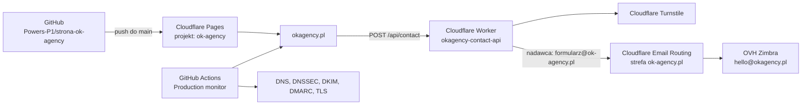

# Produkcja OK Agency — konfiguracja i utrzymanie

Stan dokumentacji: 2026-07-29.

Ten dokument opisuje produkcyjną konfigurację serwisu, podział
odpowiedzialności między GitHub, Cloudflare i OVH oraz bezpieczne procedury
zmian. Całość została zaprojektowana tak, aby działała w ramach Cloudflare
Free. Nie zapisujemy tutaj tokenów, haseł ani wartości sekretów.

## 1. Architektura



Serwis jest statyczny. Cloudflare Pages publikuje zawartość katalogu `dist/`,
a osobny Worker obsługuje wyłącznie endpoint formularza kontaktowego.

## 2. Systemy i miejsca konfiguracji

| Obszar | System | Gdzie szukać |
| --- | --- | --- |
| Kod i automatyzacja | GitHub | repozytorium `Powers-P1/strona-ok-agency` |
| Hosting strony | Cloudflare Pages | Workers & Pages → `ok-agency` |
| API formularza | Cloudflare Workers | Workers & Pages → `okagency-contact-api` |
| DNS obu domen | Cloudflare | Websites → domena → DNS → Records |
| DNSSEC, SSL i HSTS | Cloudflare | domena → DNS → Settings oraz SSL/TLS → Edge Certificates |
| Przekierowania domen | Cloudflare | domena → Rules → Redirect Rules |
| Turnstile | Cloudflare | Turnstile → widget `okagency-contact` |
| Web Analytics | Cloudflare | Analytics & Logs → Web Analytics |
| Rejestracja domen i rekordy DS | OVHcloud | Web Cloud → Domain names → domena |
| Skrzynka `hello@okagency.pl` | OVHcloud | Web Cloud → Email / Zimbra |
| Sekrety wdrożeniowe | GitHub | Settings → Secrets and variables → Actions |
| Sekret Turnstile | Cloudflare Worker | `okagency-contact-api` → Settings → Variables and Secrets |

## 3. Domeny i ruch WWW

### `okagency.pl`

- domena kanoniczna strony;
- rejestrator: OVHcloud;
- autorytatywny DNS: Cloudflare (`ara.ns.cloudflare.com` i
  `pranab.ns.cloudflare.com`);
- zawartość: projekt Cloudflare Pages `ok-agency`;
- poczta przychodząca: OVH Zimbra;
- `https://www.okagency.pl/*` jest przekierowywane kodem `301` na
  `https://okagency.pl/*` przez Cloudflare Redirect Rules;
- `www` nie wymaga osobnego podpięcia jako custom domain do Pages.

### `ok-agency.pl`

- domena alternatywna;
- rejestrator: OVHcloud;
- autorytatywny DNS: Cloudflare;
- `https://ok-agency.pl/*` i `https://www.ok-agency.pl/*` są przekierowywane
  kodem `301` na domenę kanoniczną;
- strefa jest dodatkowo używana przez darmowy Cloudflare Email Routing jako
  zweryfikowana domena nadawcy formularza.

### Domena Pages

Dokładny host produkcyjny `ok-agency.pages.dev` przekierowuje na
`okagency.pl`, zachowując ścieżkę i query string. Odpowiada za to
[`functions/_middleware.js`](../functions/_middleware.js).

Haszowane adresy i aliasy wdrożeń preview pozostają dostępne dla pull
requestów. Nie są domeną kanoniczną.

## 4. Cloudflare Pages

Konfiguracja projektu `ok-agency`:

| Ustawienie | Wartość |
| --- | --- |
| Provider | GitHub |
| Repozytorium | `Powers-P1/strona-ok-agency` |
| Gałąź produkcyjna | `main` |
| Build command | `npm run build` |
| Build output directory | `dist` |
| Node.js | 24 w CI i Pages, minimum 22 lokalnie |

Build wykonuje [`scripts/build.mjs`](../scripts/build.mjs):

1. kopiuje produkcyjne HTML-e i `assets/`;
2. kopiuje `robots.txt`, `sitemap.xml` i `.well-known/`;
3. generuje finalny plik `_headers`;
4. oblicza hashe CSP dla dozwolonych atrybutów `style`;
5. odrzuca build, jeśli ktoś ponownie doda `<style>`, wykonywalny skrypt
   inline albo `unsafe-inline`.

Szablon nagłówków znajduje się w [`_headers`](../_headers), a generator CSP w
[`scripts/csp.mjs`](../scripts/csp.mjs).

## 5. Formularz kontaktowy

### Przepływ

1. `kontakt.html` renderuje widget Turnstile.
2. Przeglądarka wysyła JSON do `POST https://okagency.pl/api/contact`.
3. Worker sprawdza metodę, `Origin`, typ i rozmiar body oraz pola formularza.
4. Worker weryfikuje token Turnstile po stronie serwera.
5. Wiadomość jest wysyłana jako `formularz@ok-agency.pl` do
   `hello@okagency.pl`; adres użytkownika trafia do `Reply-To`.

Kod endpointu: [`worker/contact.js`](../worker/contact.js).

Istotne zabezpieczenia:

- dozwolone origins: `https://okagency.pl` i `https://www.okagency.pl`;
- tylko `POST /api/contact`;
- maksymalny request: 16 KiB;
- maksymalna wiadomość: 5000 znaków;
- honeypot `fax`;
- Turnstile action: `contact`;
- kontrola hostname Turnstile;
- token Turnstile jest jednorazowy;
- odpowiedzi API i logi nie zawierają treści formularza.

### Worker

Nazwa: `okagency-contact-api`.

Konfiguracja: [`wrangler.contact.jsonc`](../wrangler.contact.jsonc).

Trasy:

- `okagency.pl/api/contact*`;
- `www.okagency.pl/api/contact*`.

Jawne zmienne konfiguracyjne:

| Zmienna | Wartość |
| --- | --- |
| `CONTACT_FROM` | `formularz@ok-agency.pl` |
| `CONTACT_TO` | `hello@okagency.pl` |
| `TURNSTILE_HOSTNAMES` | `okagency.pl,www.okagency.pl` |

Binding `SEND_EMAIL` jest ograniczony do:

- nadawcy `formularz@ok-agency.pl`;
- odbiorcy `hello@okagency.pl`.

Worker nie ma publicznej domeny `workers.dev`. Observability i invocation logs
są włączone z próbkowaniem 100%. Poprawna wysyłka zapisuje zdarzenie
`contact_email_sent`, a błąd `contact_email_send_failed` bez danych klienta.

### Turnstile

Widget: `okagency-contact`, tryb Managed, bez pre-clearance.

Dozwolone hosty:

- `okagency.pl`;
- `www.okagency.pl`;
- `ok-agency.pl`;
- `www.ok-agency.pl`;
- `localhost`;
- `127.0.0.1`.

Publiczny site key znajduje się w
[`kontakt.html`](../kontakt.html). Tajny klucz istnieje wyłącznie jako
zaszyfrowany sekret Workera `TURNSTILE_SECRET` i nie może trafić do GitHuba,
pliku `.env`, dokumentacji ani logów.

Aktualizacja sekretu z CLI:

```powershell
npx wrangler secret put TURNSTILE_SECRET --config wrangler.contact.jsonc
```

## 6. Poczta i ochrona domen

### Skrzynka firmowa `hello@okagency.pl`

Skrzynka znajduje się w OVH Zimbra. Publiczna konfiguracja domeny:

| Typ | Nazwa | Wartość / cel |
| --- | --- | --- |
| MX 1 | `okagency.pl` | `mx1.mail.ovh.net` |
| MX 5 | `okagency.pl` | `mx2.mail.ovh.net` |
| MX 100 | `okagency.pl` | `mx3.mail.ovh.net` |
| SPF | `okagency.pl` | `v=spf1 include:mx.ovh.com -all` |
| DKIM | `ovhmo-selector-1._domainkey` | CNAME do selektora OVH |
| DKIM | `ovhmo-selector-2._domainkey` | CNAME do selektora OVH |
| DMARC | `_dmarc.okagency.pl` | `p=quarantine`, `sp=quarantine`, `adkim=s`, `aspf=s`, `pct=100` |

Raporty DMARC trafiają do raportowania Cloudflare oraz na
`hello@okagency.pl`.

### Domena nadawcy `ok-agency.pl`

Cloudflare Email Routing zostało włączone dla domeny alternatywnej, aby Worker
mógł wysyłać z `formularz@ok-agency.pl` bez płatnego Cloudflare Email
Sending.

Cloudflare zarządza trzema rekordami MX `route*.mx.cloudflare.net` oraz
rekordem DKIM `cf2024-1._domainkey`. Dodatkowo:

| Typ | Nazwa | Wartość |
| --- | --- | --- |
| SPF | `ok-agency.pl` | `v=spf1 include:_spf.mx.cloudflare.net ~all` |
| DMARC | `_dmarc.ok-agency.pl` | `p=quarantine`, `sp=quarantine`, `adkim=s`, `aspf=s`, `pct=100` |

Nie należy zastępować rekordów MX/DKIM tworzonych automatycznie przez Email
Routing ręcznymi odpowiednikami.

### Ważna decyzja kosztowa

Płatne Cloudflare Email Sending pozostaje wyłączone. Formularz używa
rozwiązania zgodnego z Cloudflare Free: Worker Send Email binding +
zweryfikowany sender w Email Routing.

## 7. DNS, DNSSEC i TLS

- Cloudflare jest autorytatywnym DNS dla obu domen.
- DNS Anycast jest właściwością usługi Cloudflare DNS i nie wymaga osobnej
  konfiguracji ani dopłaty.
- DNSSEC działa dla `okagency.pl` i `ok-agency.pl`.
- Rekordy DS są utrzymywane u rejestratora OVHcloud.
- Zmieniając DNSSEC, należy zawsze skopiować bieżący DS z Cloudflare do OVH;
  nie należy przepisywać wartości z dokumentacji historycznej.
- Stary `ftp.okagency.pl` został usunięty.
- Stare rekordy TXT mechanizmu przekierowań OVH zostały usunięte.

TLS:

- certyfikaty: Cloudflare Universal SSL;
- tryb HTTPS i przekierowania są realizowane na brzegu Cloudflare;
- HSTS dla obu domen: `max-age=15552000` (6 miesięcy);
- `includeSubDomains` i preload są celowo wyłączone, aby nie obejmować
  przyszłych subdomen i nie wprowadzać trudnego do odwrócenia preloadu;
- ręczny CAA nie został dodany — Cloudflare zarządza wymaganiami CA dla
  Universal SSL, a zbyt wąski CAA mógłby zablokować odnowienie certyfikatu.

## 8. Nagłówki bezpieczeństwa i SEO

Finalne nagłówki po buildzie obejmują:

- CSP bez `unsafe-inline`;
- `frame-ancestors 'none'` i `X-Frame-Options: DENY`;
- `X-Content-Type-Options: nosniff`;
- `Referrer-Policy: strict-origin-when-cross-origin`;
- ograniczone Permissions Policy;
- COOP i Cross-Origin-Resource-Policy;
- `upgrade-insecure-requests`.

Źródła zewnętrzne w CSP są ograniczone do Google Fonts, Cloudflare Turnstile
i Cloudflare Web Analytics.

SEO:

- domena kanoniczna: `https://okagency.pl`;
- canonicale znajdują się w HTML;
- sitemap używa adresów bez `.html`;
- `robots.txt` wskazuje sitemapę;
- `ok-agency.pages.dev` nie publikuje duplikatu treści;
- `security.txt` znajduje się w
  [`.well-known/security.txt`](../.well-known/security.txt).

Przy zmianie kontaktu należy zaktualizować `security.txt`. Przed datą
`Expires` trzeba odnowić jego termin.

## 9. Web Analytics

Cloudflare Web Analytics jest skonfigurowane w trybie automatycznym dla
`okagency.pl`. Beacon jest wstrzykiwany przez Cloudflare i nie jest ręcznie
wklejony do HTML.

CSP zezwala na:

- skrypt `https://static.cloudflareinsights.com`;
- połączenia do `https://cloudflareinsights.com` oraz własnej domeny.

To rozwiązanie działa w Cloudflare Free.

## 10. GitHub i wdrożenia

### Ochrona `main`

Włączone są:

- wymagane checki `validate` i `Cloudflare Pages`;
- aktualność gałęzi względem `main`;
- egzekwowanie zasad dla administratorów;
- linear history;
- wymagane rozwiązanie komentarzy review;
- blokada force-push i usuwania gałęzi.

Secret scanning, push protection, Dependabot alerts i Dependabot security
updates są włączone.

### Workflowy

| Workflow | Plik | Uruchomienie |
| --- | --- | --- |
| CI | [`.github/workflows/ci.yml`](../.github/workflows/ci.yml) | PR oraz push do `main` |
| Worker deploy | [`.github/workflows/contact-worker-deploy.yml`](../.github/workflows/contact-worker-deploy.yml) | zmiana Workera/configu na `main` lub ręcznie |
| Production monitor | [`.github/workflows/production-monitor.yml`](../.github/workflows/production-monitor.yml) | co 6 godzin i ręcznie |

Akcje GitHub są przypięte do pełnych SHA.

### Sekrety GitHub Actions

Repozytorium ma dwa sekrety potrzebne wyłącznie do wdrażania Workera:

- `CLOUDFLARE_WORKERS_DEPLOY_TOKEN`;
- `CLOUDFLARE_ACCOUNT_ID`.

Token Cloudflare powinien mieć tylko:

- Account → Workers Scripts → Edit dla właściwego konta;
- Zone → Workers Routes → Edit wyłącznie dla `okagency.pl`.

Nie należy dodawać mu uprawnień DNS, Pages, Turnstile, billing ani profile.

## 11. Monitoring i alerty

Workflow `Production monitor` działa o minucie 17 co 6 godzin. Sprawdza:

- dostępność strony głównej, kontaktu, `security.txt` i API;
- przekierowania `www`, domeny alternatywnej i `pages.dev`;
- HSTS obu domen;
- DNSSEC obu domen;
- DMARC i DKIM obu domen wysyłających;
- brak starego `ftp.okagency.pl`;
- ważność certyfikatu przez co najmniej 21 dni.

Awaria otwiera lub aktualizuje issue z etykietą `production-monitor`.
Powrót do poprawnego działania dodaje komentarz i zamyka issue.

Ręczne uruchomienie:

```powershell
gh workflow run production-monitor.yml `
  --repo Powers-P1/strona-ok-agency `
  --ref main
```

## 12. Procedury operacyjne

### Zmiana strony

```powershell
npm ci
npm run check:links
npm run build
npm run check:pages-functions
npm run check:worker
```

Następnie:

1. utwórz gałąź;
2. wypchnij zmiany;
3. utwórz pull request;
4. poczekaj na `validate` i `Cloudflare Pages`;
5. rozwiąż komentarze review;
6. scal PR do `main`;
7. sprawdź produkcję i uruchom ręcznie monitor.

### Zmiana Workera

Zmiany w `worker/**`, `wrangler.contact.jsonc`, zależnościach lub workflow
wdrożeniowym automatycznie uruchamiają `Contact Worker deploy` po merge do
`main`.

Po wdrożeniu sprawdź:

```powershell
curl.exe -I https://okagency.pl/api/contact
```

Poprawny request `GET` powinien zwrócić `405` i nagłówek `Allow: POST`.
Pełny test wysyłki wymaga świeżego tokenu Turnstile z formularza.

### Rotacja tokenu wdrożeniowego

1. Utwórz nowy token w Cloudflare z opisanymi wyżej minimalnymi
   uprawnieniami.
2. Zastąp `CLOUDFLARE_WORKERS_DEPLOY_TOKEN` w GitHub Actions Secrets.
3. Uruchom ręcznie `Contact Worker deploy`.
4. Po poprawnym wdrożeniu unieważnij poprzedni token.

Nigdy nie wklejaj tokenu do issue, PR, terminalowego polecenia zapisywanego w
historii ani pliku repozytorium.

### Zmiana Turnstile

1. Zachowaj nazwę widgetu i listę hostów.
2. Zaktualizuj publiczny site key w `kontakt.html`.
3. Zapisz nowy secret jako `TURNSTILE_SECRET` Workera.
4. Wdróż stronę i Worker.
5. Wykonaj pełny test formularza i sprawdź zdarzenie
   `contact_email_sent`.

### Zmiana DNS lub DNSSEC

1. Zrób zrzut bieżących rekordów.
2. Zmień tylko właściwą strefę w Cloudflare.
3. Przy DNSSEC zsynchronizuj DS w OVH.
4. Poczekaj na propagację.
5. Sprawdź rekord z publicznego resolvera i uruchom monitor produkcji.

Przykłady:

```powershell
Resolve-DnsName okagency.pl -Type NS -Server 1.1.1.1
Resolve-DnsName okagency.pl -Type MX -Server 1.1.1.1
Resolve-DnsName _dmarc.okagency.pl -Type TXT -Server 1.1.1.1
curl.exe -I https://okagency.pl/
curl.exe -I https://ok-agency.pl/
```

## 13. Granice darmowego wariantu

Celowo wyłączone lub niewykorzystywane:

- płatne Cloudflare Email Sending;
- ręczny CAA ograniczający wystawców Universal SSL;
- HSTS preload;
- osobny Pages custom domain dla `www`;
- publiczna domena `workers.dev` dla formularza.

Nie należy włączać płatnej funkcji Cloudflare bez osobnej decyzji. 2FA i
metody płatności nie są częścią konfiguracji tego repozytorium.
